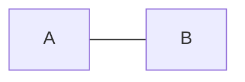

# System Programming 2 - assignment 1

## Author
- [Shay Gali](https://github.com/shayGali)
- Email: shay.gali@msmail.ariel.ac.il

In this assignment, we will implement some graph algorithms using C++.


we have two main classes in this assignment:
* Graph
* Algorithms

we will explain each class in the following sections.

One of the assignment goals is to use `namespace` in the code, so we will use the `shayg` namespace for wrapping the classes and functions in this assignment.


## Graph
This is a class that represents a graph. The graph can be directed or undirected, weighted or unweighted and with positive or negative weights.

All the graph don't have self-loops and multiple edges.

To Represent the graph, we will use an adjacency matrix.


each graph object saves the following properties:
* isDirected : a boolean that represents if the graph is directed or not.
* isWeighted : a boolean that represents if the graph is weighted or not.
* haveNegativeEdgeWeight : a boolean that represents if the graph have negative edge weights or not.


To initialize a `Graph` object, you need to pass if the graph is directed or not. (default is undirected)
```cpp
Graph g(true);  // directed graph

Graph g(false); // undirected graph
Graph g;        // undirected graph
```

We define the constants `INF` and `NO_EDGE` to represent the infinity and no edge in the graph.

- `INF` = `std::numeric_limits<int>::max()` = `2147483647` (so make sure not to do `INF + INF` so you don't get overflow)
- `NO_EDGE` = `INF`, but can be any other value that is not used in the graph.

### Functions

#### loadGraph

This function will initialize the graph with the given adjacency matrix.

it will check for valid input, and initialize the graph properties.

if the input is invalid, the function will throw an `invalid_argument` exception.

#### printGraph
print information about the graph,in the following format: `Directed/Undirected graph with |V| vertices and |E| edges.`
where $|V|$ is the number of vertices in the graph, and $|E|$ is the number of edges in the graph.

> Note: This graph, contains one edge and 2 vertices.


## Algorithms
This class have only static functions that perform some algorithms on the graph.

### Color enum
A helper enum that represents the color of the vertices in the graph. it can be `WHITE`, `GRAY`, `BLACK`, `BLUE` or `RED`.

The `WHITE`, `GRAY` and `BLACK` colors are used in the DFS algorithm, and the `BLUE` and `RED` colors are used in the bipartite algorithm.

### NegativeCycleException class
This is a custom exception class that will be thrown when the graph contains a negative cycle, in the Bellman-Ford algorithm.

we find a negative cycle in the graph if the Bellman-Ford algorithm we can relax the edges in the last iteration.
when we find that edge, we will throw this exception, we the vertex and the parents array to construct the negative cycle.
The constructor of this class will take the vertex and the parents array, and build the cycle path.

### isConnected

In this function, we will use the DFS algorithm to check if the graph is connected or not.

to check if undirected graph is connected, we can perform DFS on the graph and check if all the vertices are discovered.

The way to check if a directed graph is connected is transformed DFS twice:
1. Perform DFS on the graph.
2. If the DFS discovers all the vertices, then the graph is connected. (if we got only one DFS tree)
3. Perform DFS on the root of the last DFS tree.
4. If the DFS discovers all the vertices, then the graph is connected. otherwise, the graph is not connected.

### shortestPath

In this function, we will use the one of 3 algorithms to find the shortest path between two vertices in a graph.

* if the graph is unweighted, we will use the BFS algorithm to find the shortest path between two vertices.
* if the graph is weighted and the weights are positive, we will use the Dijkstra algorithm to find the shortest path between two vertices.
* if the graph is weighted and the weights are negative, we will use the Bellman-Ford algorithm to find the shortest path between two vertices.

> Note: we represent the graph as an adjacency matrix, so both Dijkstra and Bellman-Ford algorithms run in $O(V^3)$ time complexity.


If there is no path between the two vertices, the function will return "-1".


### isContainsCycle
In this function we check if the graph contains a cycle or not. If the graph contains a cycle, the function will return one of the cycles in this format: `v1->v2->v3->...->v1`. otherwise, the function will return "-1".

#### helper function
for this function, we will use two helper functions:
1. `isContainsCycleUtil`: this function is slightly modified version of the DFS algorithm. it runs until it finds a back edge in the graph, when it finds a back edge, it will call the `constructCyclePath` function to construct the cycle path.
2. `constructCyclePath`: this function will construct the cycle path by backtracking the path array.
A graph contains a cycle if there is a back edge in the graph. so we can use the DFS algorithm to check if the graph contains a cycle or not.

#### cycle in undirected graph

In an undirected graph, a cycle needs at least 3 vertices. so the next graph **DON'T** contain a cycle.


### isBipartite
In this function, we will use the BFS algorithm to check if the graph is bipartite or not. A graph is bipartite iff it is 2-colorable. so we can use the BFS algorithm to check if the graph is bipartite or not.

For directed graphs, we need to convert the directed graph to an undirected graph, because we don't care about the direction of the edges in this function (and the weights).

If the graph is bipartite, the function will return any to sets of vertices that represent a bipartite graph. otherwise, the function will return  `"The graph is not bipartite"`.

The returned format will be: `"The graph is bipartite: A={...}, B={...}"`

### negativeCycle

This function will use the Bellman-Ford algorithm to check if the graph contains a negative cycle or not. If the graph contains a negative cycle, the function will return one of the negative cycles in this format: `v1->v2->v3->...->v1`. otherwise, the function will return `"No negative cycle"`

The way we can find a negative cycle in the graph is to add new vertex `s` and connect it with all the vertices in the graph with weight 0, and for each $uv \notin E$ we will define $w(uv) = \infty$. then we will run the Bellman-Ford algorithm on the graph with the new vertex `s`. if the Bellman-Ford algorithm finds a negative cycle, then the graph contains a negative cycle.

> Note: the Bellman-Ford algorithm **DON'T** work with undirected graphs with negative weights.


## Test
I wrote a full README file for the test, you can find it [here](./tests/README.md)